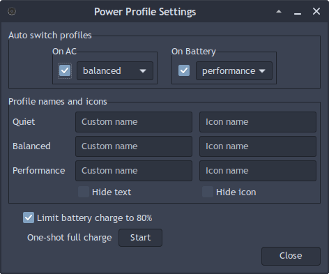

# xfce4-asusd-battery

XFCE panel plugin for managing laptop power profiles [asusd](https://github.com/OpenGamingCollective/asusctl).

# Features

- **Profile switching**: Switch between available performance profiles with a single click.
- **Battery charge limit**: Set battery charge limit to 80% to extend battery lifespan.
- **Customizable display**: Rename profiles and assign custom GTK icons for each mode.
- **Hide elements**: Option to hide icon or text independently.
- **i18n support**: Built-in translations for multiple languages (mostly AI-generated, but its a simple plugin without complicated texts anyway).
- **D-Bus integration**: Instant response to power status changes using D-Bus signals.

# Dependencies

The main one: [asusd](https://github.com/OpenGamingCollective/asusctl) daemon up and running. 

### Build dependencies

```
# Debian/Ubuntu
sudo apt install make build-essential libgtk-3-dev libxfce4panel-2.0-dev libxfce4util-dev libxfconf-0-dev pkg-config gettext libxfce4ui-2-dev

# Fedora/RHEL
sudo dnf install gcc make gtk3-devel libxfce4util-devel xfce4-panel-devel xfconf-devel pkgconfig gettext

# Arch Linux
sudo pacman -S make gcc gtk3 libxfce4util xfce4-panel xfconf pkg-config gettext

# Gentoo
sudo emerge -av dev-util/pkgconf sys-devel/gettext x11-libs/gtk+:3 xfce-base/libxfce4util xfce-base/xfce4-panel xfce-base/xfconf dev-libs/glib

# OpenSUSE
sudo zypper install make gcc pkg-config glib2-devel gtk3-devel libxfce4util-devel xfce4-panel-devel xfconf-devel gettext-tools

```

### Runtime dependencies

- **XFCE4 panel**
- **[asusd](https://github.com/OpenGamingCollective/asusctl)**
- **notify-send** (for desktop notifications)

# Installation
you can do just "sudo make install" to install compiled version without having to install all build dependencies (you still need to install package "make" for it to work)
please note precompiled .so has x86-64 arch.

or compile yourself:

```
# Clone the repository
git clone https://github.com/korn3r/xfce4-asusd-battery.git
cd xfce4-asusd-battery

# Bundled help screen

```
# make help

Available targets:
  all                  - Build plugin and translations
  install              - Install plugin and translations
  install-translations - Install only translations (from locale/ directory)
  uninstall            - Uninstall plugin
  clean                - Remove built files (including locale/ directory)
  debug                - Build with debug symbols
  translations         - Build translations (checks if already built)
  force-translations   - Force rebuild translations
  info                 - Show build information
  check                - Check dependencies
  help                 - Show this help

Variables:
  LANGUAGES            - Space-separated list of languages (e.g. 'ru de fr')
  DESTDIR              - Installation prefix (e.g. DESTDIR=/tmp/test)

Examples:
  make                           - Build with all languages
  make LANGUAGES="ru de"         - Build with Russian and German only
  make LANGUAGES=""              - Build without translations
  make force-translations        - Force rebuild all translations
  sudo make install              - Install plugin
  sudo make install-translations - Install translations from locale/ directory


```

# Build and install
make
sudo make install

# Restart the panel
xfce4-panel -r
```

# Uninstall

```
sudo make uninstall
xfce4-panel -r
```

# Configuration

Right-click the plugin icon and select Settings to open the configuration dialog:



# Auto Switching

Enable auto switching to automatically change profiles when power source changes:

- On battery: Select profile for battery mode
- On AC: Select profile for AC power mode

# Profile Customization

For each profile, you can customize:

- Text: Custom display name
- Icon: GTK icon name (e.g., battery-full-symbolic)

# Display Options

- Hide icon: Show only text on the panel
- Hide text: Show only icon on the panel

# License

This project is licensed under the MIT License - see the LICENSE file for details.
Authors

- korn3r — implementation, testing and integration
- Deepseek — architecture, design & code assistance

# Acknowledgments

- XFCE panel plugin API documentation
- Linux kernel platform_profile interface
- asusctl software

# Donation
If you would like this plugin and want to support someone, you can donate to asusctl developers. Links are on [asusctl Github page](https://github.com/OpenGamingCollective/asusctl).
